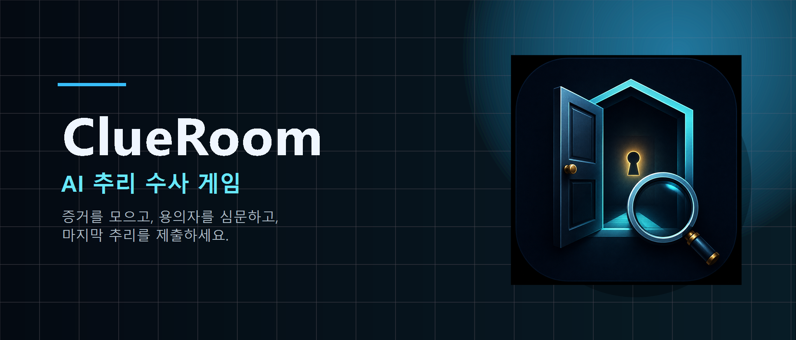
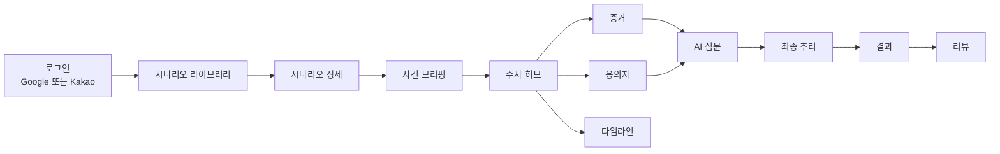
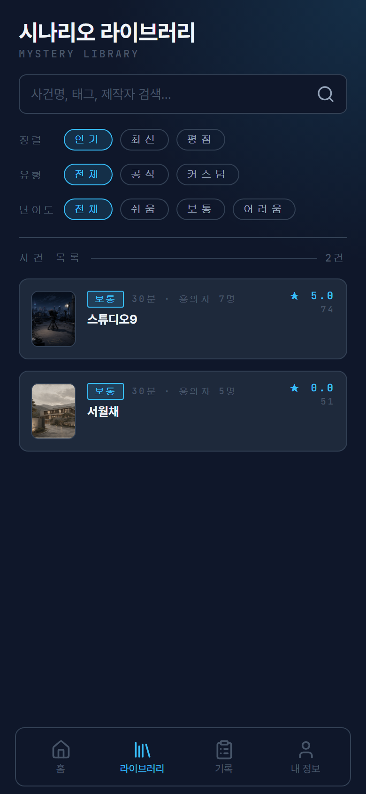
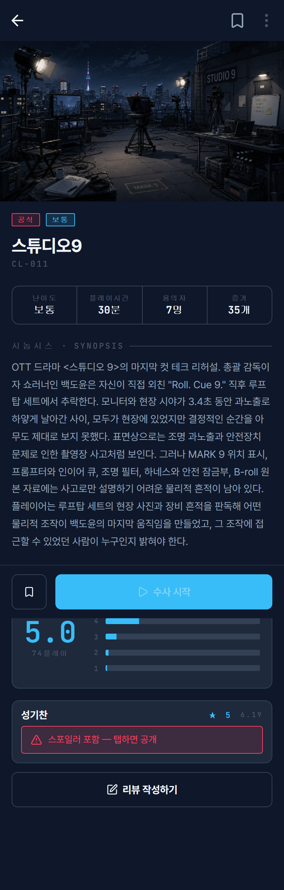
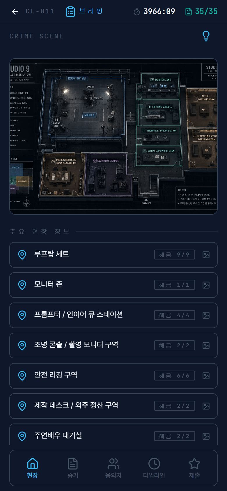
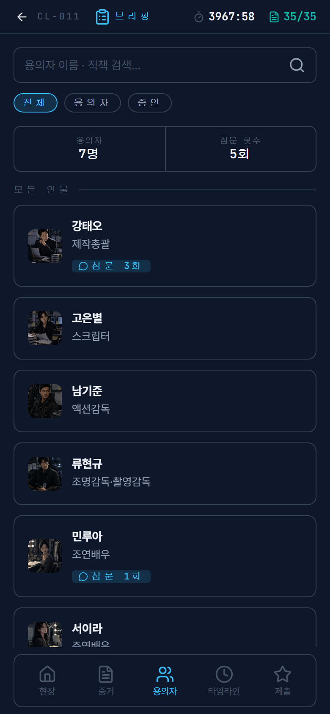

# ClueRoom Web

ClueRoom Web은 Flutter Android 앱의 핵심 플레이 흐름을 일반 브라우저에서 실행할 수 있도록 이식한 React/Vite 웹 프론트엔드입니다. 운영 API(`https://api.clueroom.xyz`)와 같은 인증/플레이 계약을 사용하며, 웹 배포 URL은 `https://www.clueroom.xyz`입니다.

<p align="center">
  
</p>

<p align="center">
  <a href="https://www.clueroom.xyz"></a>
  <a href="https://api.clueroom.xyz/actuator/health"></a>
  
  
  
</p>

## 한눈에 보기

| 영역 | 웹 클라이언트가 담당하는 범위 |
|---|---|
| 제품 화면 | 시나리오 라이브러리, 사건 브리핑, 수사 허브, 증거, 용의자, 타임라인, 심문, 최종 추리, 결과, 프로필 |
| 인증 | Google OAuth, Kakao authorization-code login, 백엔드 JWT access token, HttpOnly refresh cookie |
| 앱/웹 호환성 | Android 앱과 같은 백엔드 시나리오, 북마크, 리뷰, 플레이 세션, 심문, 결과, 기록 계약 사용 |
| AI UX | 심문 응답 표시, 증거 제시 질문, 추천 질문 prefill, AI quota 안내 배너 |
| 배포 | `scripts/deploy-web.sh`로 Vite 정적 빌드를 Nginx web root에 배포 |
| 제외 범위 | Apps in Toss `.ait`, Toss `appLogin()`, `/api/auth/toss`, Android APK/AAB, FCM |

## 검증 스냅샷

| 검증 항목 | 현재 근거 |
|---|---|
| 단위/회귀 테스트 | `npm test`가 `src/**/*.test.ts`를 실행하며, 최근 확인 기준 **23 tests** |
| 정적 검증 | `npm run lint`, `npx tsc -b`, `npm run build` |
| OAuth smoke | 운영 웹에서 Google/Kakao 로그인 smoke 확인 |
| 세션 안정성 | HttpOnly refresh cookie, `credentials: "include"`, single-flight refresh retry |
| 백엔드 호환성 | 서버 기반 북마크/리뷰, records API 우선 사용, 최종 결과 retry 상태 |
| AI quota UX | 백엔드 message가 없어도 stage 기준으로 quota 안내 표시 |

## 관련 레포지토리

| Repository | Scope |
|---|---|
| [`clueroom-web-fe`](https://github.com/Final-Project-sixteam-company/clueroom-web-fe) | 현재 레포. React/Vite 웹 배포 surface |
| [`start-up-project`](https://github.com/Final-Project-sixteam-company/start-up-project) | Spring Boot 백엔드, AI/gameplay domain, infra, LLMOps, QA 문서 |
| [`project-fe`](https://github.com/Final-Project-sixteam-company/project-fe) | Flutter Android 앱, OAuth/session runtime, gameplay UI |
| [Organization profile](https://github.com/Final-Project-sixteam-company) | 제품 소개, 팀 소개, 전체 repo map |

## 제품 흐름



## 화면 증빙

공개 README에는 스포일러 위험이 낮은 화면만 포함합니다. 심문 원문 기록, 타임라인 상세, 최종 결과 화면은 정답성/증거 흐름을 노출할 수 있어 제외했습니다.

| 시나리오 라이브러리 | 시나리오 상세 |
|---|---|
|  |  |

| 수사 허브 | 용의자 목록 |
|---|---|
|  |  |

## 웹 프론트 핵심

### 앱 흐름 기반 브라우저 웹

- Flutter Android의 MVP 플레이 흐름을 React/Vite 웹 화면으로 재구성했습니다.
- 화면은 모바일 우선으로 설계하고, 데스크톱에서는 앱형 패널 레이아웃이 과하게 늘어나지 않도록 제한합니다.
- `components/screens`는 실제 라우트/화면 단위, `components/domain`은 증거/인물/타임라인 같은 도메인 UI 단위로 분리했습니다.

### 인증과 세션 복구

- Google은 Google Identity Services의 ID token을 `POST /api/auth/oauth`로 전달합니다.
- Kakao는 JavaScript SDK authorization code를 `POST /api/auth/oauth/kakao/code`로 전달하고, token exchange는 백엔드가 수행합니다.
- refresh token은 JavaScript 저장소에 보관하지 않고, 백엔드가 내려주는 HttpOnly cookie를 사용합니다.
- access token 만료로 여러 요청이 동시에 401을 받아도 refresh 요청은 한 번만 병합합니다.
- 로그아웃 중 완료된 stale refresh 응답은 새 세션으로 저장하지 않습니다.

### 수사 UX

- 증거 상세의 읽을 거리와 추천 질문을 플레이 흐름 안에서 사용할 수 있게 연결했습니다.
- 추천 질문 chip은 자동 전송하지 않고 입력창 prefill만 수행합니다.
- 심문 중 증거 제시 질문을 보낼 수 있도록 검색 가능한 evidence-present sheet를 제공합니다.
- 백엔드 `aiQuota` 상태를 받아 35/50/70/100/120 단계에서 정리, 힌트, 최종추리로 유도할 수 있는 배너를 표시합니다.
- 최종 추리는 제출 후 `/result` 조회가 성공해야 결과 화면으로 이동하고, 일시 실패 시 재조회 상태를 유지합니다.

### 서버 기반 계정 상태

- 북마크는 `/api/scenarios/{id}/bookmarks`와 `/api/scenarios/bookmarked`를 사용합니다.
- 리뷰는 `/api/scenarios/{id}/reviews`를 사용하며 백엔드 계약에 맞춰 1~5 정수 별점만 입력합니다.
- 수사 기록은 `/api/play-sessions/records`를 우선 사용하고, API가 아직 없거나 실패한 경우에만 브라우저 localStorage fallback을 사용합니다.

## API 호환 지도

| 기능 | 엔드포인트 |
|---|---|
| Google 로그인 | `POST /api/auth/oauth` |
| Kakao 로그인 | `POST /api/auth/oauth/kakao/code` |
| 토큰 갱신 | `POST /api/auth/refresh` with HttpOnly cookie |
| 내 정보/로그아웃 | `GET /api/auth/me`, `POST /api/auth/logout` |
| 시나리오 목록/상세 | `GET /api/scenarios`, `GET /api/scenarios/{id}` |
| 북마크 | `GET /api/scenarios/bookmarked`, `POST|DELETE /api/scenarios/{id}/bookmarks` |
| 리뷰 | `GET|POST /api/scenarios/{id}/reviews` |
| 세션 시작/복구 | `GET /api/play-sessions/active`, `POST /api/play-sessions` |
| 수사 대시보드 | `GET /api/play-sessions/{id}/dashboard` |
| 증거/용의자/타임라인/장소 | `GET /api/play-sessions/{id}/evidences`, `suspects`, `timeline`, `locations` |
| 힌트 | `GET /api/play-sessions/{id}/hints`, `POST /api/play-sessions/{id}/hints/{hintId}/use` |
| 심문 | `GET|POST /api/play-sessions/{id}/interrogations` |
| 최종 추리/결과 | `POST /api/play-sessions/{id}/final-deduction`, `GET /api/play-sessions/{id}/result` |

## 레포지토리 구조

```text
src/
  api/             API 요청 래퍼, 응답 normalizer, ApiError
  auth/            OAuth client, refresh controller, auth retry, session hook
  components/
    screens/       로그인, 라이브러리, 사건, 심문, 결과, 프로필 화면
    domain/        증거, 용의자, 타임라인, 이미지 뷰어 도메인 컴포넌트
    ui/            공통 button, sheet, modal, chip, skeleton, toast
  config/          Vite env 정규화
  game/            플레이 세션 상태, 심문/최종추리 action
  lib/             storage, polling helper
  records/         수사 기록 조회와 fallback
  result/          최종 결과 polling/rendering hook
  scenarios/       시나리오 목록/상세/북마크/리뷰 hook
  theme/           CSS token
  types/           공통 DTO/UI type

docs/
  PORTING_STATUS.md                    React 웹 포팅 현황
  RELEASE_CHECKLIST.md                 브라우저 웹 릴리스 게이트
  REACT_WEB_MIGRATION_GAMEPLAY_SPEC.md 게임플레이 이식 기준
  REACT_WEB_MIGRATION_PLAN.md          마이그레이션 계획과 이력

scripts/
  deploy-web.sh                        운영 정적 웹 배포 스크립트
```

## 환경 변수

기본 운영 API:

```bash
VITE_API_BASE_URL=https://api.clueroom.xyz
```

OAuth와 QA 로그인 플래그:

```bash
VITE_GOOGLE_CLIENT_ID=<Google Web OAuth client id>
VITE_KAKAO_JAVASCRIPT_KEY=<Kakao JavaScript key>
VITE_ENABLE_DEV_LOGIN=false
VITE_ENABLE_QA_LOGIN=false
VITE_QA_LOGIN_EMAIL=
VITE_QA_LOGIN_NICKNAME=ClueRoom QA
```

QA 로그인은 통제된 QA 빌드에서만 사용합니다. `/api/auth/dev`를 호출하므로 백엔드도 `AUTH_DEV_LOGIN_ENABLED=true`여야 합니다. 공개 운영 트래픽에서는 `VITE_ENABLE_QA_LOGIN=false`와 `AUTH_DEV_LOGIN_ENABLED=false`를 함께 유지합니다.

QA 빌드에서 `VITE_ENABLE_QA_LOGIN=true`를 켜더라도 기본 공개 루트(`/`)에는 QA 버튼이 노출되지 않습니다. 운영 QA가 필요하면 `https://www.clueroom.xyz/?qaLogin=1` 또는 `#qa-login`처럼 명시 진입 URL로 접근합니다.

## 로컬 실행

```bash
npm install
npm run dev
```

검증 명령:

```bash
npm test
npm run lint
npx tsc -b
npm run build
npm run preview
```

## 운영 배포

운영 배포는 로컬 Git Bash checkout에서 실행하며, 정적 `dist/` 번들을 운영 Nginx web root로 배포합니다.

```bash
cd /c/java/assignment/spring/clueroom-web-fe

cp .env.example .env.production
# VITE_GOOGLE_CLIENT_ID와 VITE_KAKAO_JAVASCRIPT_KEY를 확인합니다.

bash scripts/deploy-web.sh
```

배포 스크립트가 수행하는 일:

1. 로컬 변경 또는 untracked file이 남아 있으면 중단합니다.
2. tracking branch를 fetch하고 fast-forward합니다.
3. clean dependency install, lint, build를 실행합니다.
4. `dist/`를 versioned release bundle로 업로드합니다.
5. `/opt/clueroom/web/current`를 새 release로 교체합니다.
6. Nginx 설정 검증 후 reload합니다.
7. `https://www.clueroom.xyz` 응답을 확인합니다.

긴급 상황에서만 git update gate를 건너뛸 수 있습니다. 일반 배포 경로로 쓰지 않습니다.

```bash
SKIP_GIT_UPDATE=1 bash scripts/deploy-web.sh
```

## 릴리스 스모크 체크리스트

배포 후 확인:

- `https://www.clueroom.xyz` 접속
- Google 또는 Kakao 로그인
- 브라우저 localStorage에 refresh token이 저장되지 않는지 확인
- 시나리오 목록과 상세 진입
- 플레이 세션 시작 또는 복구
- 심문 질문 1회 전송
- 백엔드가 `aiQuota.stage != "NONE"`을 반환할 때 quota 안내가 표시되는지 확인
- 북마크 토글
- 저장한 사건 화면에서 방금 저장한 사건이 유지되는지 확인
- 1~5 정수 리뷰 작성
- 리뷰 등록 직후 상세 화면에 작성한 리뷰가 유지되는지 확인
- 최종 추리 제출은 QA 승인된 테스트 세션에서만 수행

자세한 기준: [docs/RELEASE_CHECKLIST.md](docs/RELEASE_CHECKLIST.md)

## 문제 해결

| 증상 | 확인할 것 |
|---|---|
| Google 버튼이 보이지 않음 | `VITE_GOOGLE_CLIENT_ID`가 비어 있거나 env 변경 후 다시 빌드하지 않았는지 확인 |
| Kakao 버튼이 보이지 않음 | `VITE_KAKAO_JAVASCRIPT_KEY`가 비어 있는지 확인 |
| Kakao redirect 오류 | Kakao Developers Web 플랫폼 도메인과 Redirect URI에 배포 origin이 등록되어 있는지 확인 |
| CORS 403 | 백엔드 `CORS_ALLOWED_ORIGIN_PATTERNS`에 `https://www.clueroom.xyz`가 포함되어 있는지 확인 |
| refresh 실패 | 요청에 `credentials: "include"`가 들어가고, 백엔드 cookie 설정이 운영 origin과 맞는지 확인 |
| QA 버튼이 공개 루트에 보이지 않음 | 정상 동작입니다. QA 빌드에서는 `?qaLogin=1` 또는 `#qa-login`으로 진입 |
| `npm test`가 0 tests로 끝남 | test script가 `node --test "src/**/*.test.ts"` 형태를 유지하는지 확인 |
| 배포 스크립트가 dirty tree로 중단됨 | 배포 전 local 변경을 commit, stash, remove 중 하나로 정리 |

## 범위 경계

이 레포지토리는 브라우저 웹 프론트엔드만 산출합니다.

- Standalone Android APK/AAB는 Flutter 앱 레포지토리에서 관리합니다.
- Apps in Toss 패키징은 폐기되었습니다.
- Toss `appLogin()`과 `/api/auth/toss`는 이 웹 릴리스 경로에 포함되지 않습니다.
- FCM push integration은 현재 이 레포지토리 범위 밖입니다.
