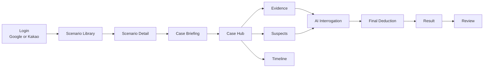

# ClueRoom Web

ClueRoom Web은 Flutter Android 앱의 핵심 플레이 흐름을 일반 브라우저에서 실행할 수 있도록 이식한 React/Vite 웹 프론트엔드입니다. 운영 API(`https://api.clueroom.xyz`)와 같은 인증/플레이 계약을 사용하며, 웹 배포 URL은 `https://www.clueroom.xyz`입니다.

<p align="center">
  <a href="https://www.clueroom.xyz"></a>
  <a href="https://api.clueroom.xyz/actuator/health"></a>
  
  
  
</p>

## At A Glance

| Area | What This Web Client Handles |
|---|---|
| Product surface | Scenario library, case briefing, investigation hub, evidence, suspects, timeline, interrogation, final deduction, result, profile |
| Auth | Google OAuth, Kakao authorization-code login, backend JWT access token, HttpOnly refresh cookie |
| App/Web compatibility | Shared backend scenario, bookmark, review, play-session, interrogation, result, and record contracts |
| AI UX | Interrogation response rendering, evidence-present question flow, suggested question prefill, AI quota guidance banner |
| Release | Static Vite build deployed to Nginx with `scripts/deploy-web.sh` |
| Deprecated scope | Apps in Toss `.ait`, Toss `appLogin()`, `/api/auth/toss`, Android APK/AAB, FCM |

## Proof Snapshot

| Gate | Current Evidence |
|---|---|
| Unit/regression tests | `npm test` runs `src/**/*.test.ts`, latest checked target: **23 tests** |
| Static checks | `npm run lint`, `npx tsc -b`, `npm run build` |
| OAuth smoke | Google/Kakao production login smoke checked by operator |
| Session hardening | HttpOnly refresh cookie, `credentials: "include"`, single-flight refresh retry |
| Backend compatibility | Server-backed bookmarks/reviews, records API first with local fallback, final-result retry state |
| AI quota UX | Renders quota guidance by stage even when backend message is absent |

## Product Flow



## Frontend Highlights

### Browser Web Built From The App Flow

- Flutter Android의 MVP 플레이 흐름을 React/Vite 웹 화면으로 재구성했습니다.
- 화면은 모바일 우선으로 설계하고, 데스크톱에서는 앱형 패널 레이아웃이 과하게 늘어나지 않도록 제한합니다.
- `components/screens`는 실제 라우트/화면 단위, `components/domain`은 증거/인물/타임라인 같은 도메인 UI 단위로 분리했습니다.

### Auth And Session Recovery

- Google은 Google Identity Services의 ID token을 `POST /api/auth/oauth`로 전달합니다.
- Kakao는 JavaScript SDK authorization code를 `POST /api/auth/oauth/kakao/code`로 전달하고, token exchange는 백엔드가 수행합니다.
- refresh token은 JavaScript 저장소에 보관하지 않고, 백엔드가 내려주는 HttpOnly cookie를 사용합니다.
- access token 만료로 여러 요청이 동시에 401을 받아도 refresh 요청은 한 번만 병합합니다.
- 로그아웃 중 완료된 stale refresh 응답은 새 세션으로 저장하지 않습니다.

### Investigation UX

- 증거 상세의 읽을 거리와 추천 질문을 플레이 흐름 안에서 사용할 수 있게 연결했습니다.
- 추천 질문 chip은 자동 전송하지 않고 입력창 prefill만 수행합니다.
- 심문 중 증거 제시 질문을 보낼 수 있도록 검색 가능한 evidence-present sheet를 제공합니다.
- 백엔드 `aiQuota` 상태를 받아 35/50/70/100/120 단계에서 정리, 힌트, 최종추리로 유도할 수 있는 배너를 표시합니다.
- 최종 추리는 제출 후 `/result` 조회가 성공해야 결과 화면으로 이동하고, 일시 실패 시 재조회 상태를 유지합니다.

### Server-Backed Account State

- 북마크는 `/api/scenarios/{id}/bookmarks`와 `/api/scenarios/bookmarked`를 사용합니다.
- 리뷰는 `/api/scenarios/{id}/reviews`를 사용하며 백엔드 계약에 맞춰 1~5 정수 별점만 입력합니다.
- 수사 기록은 `/api/play-sessions/records`를 우선 사용하고, API가 아직 없거나 실패한 경우에만 브라우저 localStorage fallback을 사용합니다.

## API Compatibility Map

| Feature | Endpoint |
|---|---|
| Google login | `POST /api/auth/oauth` |
| Kakao login | `POST /api/auth/oauth/kakao/code` |
| Refresh | `POST /api/auth/refresh` with HttpOnly cookie |
| Me/logout | `GET /api/auth/me`, `POST /api/auth/logout` |
| Scenario library/detail | `GET /api/scenarios`, `GET /api/scenarios/{id}` |
| Bookmarks | `GET /api/scenarios/bookmarked`, `POST|DELETE /api/scenarios/{id}/bookmarks` |
| Reviews | `GET|POST /api/scenarios/{id}/reviews` |
| Session start/recovery | `GET /api/play-sessions/active`, `POST /api/play-sessions` |
| Investigation dashboard | `GET /api/play-sessions/{id}/dashboard` |
| Evidence/suspect/timeline/location | `GET /api/play-sessions/{id}/evidences`, `suspects`, `timeline`, `locations` |
| Hints | `GET /api/play-sessions/{id}/hints`, `POST /api/play-sessions/{id}/hints/{hintId}/use` |
| Interrogation | `GET|POST /api/play-sessions/{id}/interrogations` |
| Final deduction/result | `POST /api/play-sessions/{id}/final-deduction`, `GET /api/play-sessions/{id}/result` |

## Repository Map

```text
src/
  api/             API request wrapper, response normalizers, ApiError
  auth/            OAuth clients, refresh controller, auth retry, session hook
  components/
    screens/       Login, library, case, interrogation, result, profile screens
    domain/        Evidence, suspect, timeline, image viewer domain components
    ui/            Shared buttons, sheets, modals, chips, skeleton, toast
  config/          Vite env normalization
  game/            Play-session state and interrogation/final-deduction actions
  lib/             Storage and polling helpers
  records/         Investigation record loading and fallback
  result/          Final result polling and rendering hook
  scenarios/       Scenario list/detail/bookmark/review hook
  theme/           CSS tokens
  types/           Shared DTO and UI types

docs/
  PORTING_STATUS.md                    Current React web porting status
  RELEASE_CHECKLIST.md                 Browser web release gate
  REACT_WEB_MIGRATION_GAMEPLAY_SPEC.md Gameplay migration reference
  REACT_WEB_MIGRATION_PLAN.md          Migration plan and history

scripts/
  deploy-web.sh                        Production static web deploy script
```

## Environment

Default production API:

```bash
VITE_API_BASE_URL=https://api.clueroom.xyz
```

OAuth and QA login flags:

```bash
VITE_GOOGLE_CLIENT_ID=<Google Web OAuth client id>
VITE_KAKAO_JAVASCRIPT_KEY=<Kakao JavaScript key>
VITE_ENABLE_DEV_LOGIN=false
VITE_ENABLE_QA_LOGIN=false
VITE_QA_LOGIN_EMAIL=
VITE_QA_LOGIN_NICKNAME=ClueRoom QA
```

QA login is only for controlled QA builds. It calls `/api/auth/dev`, so the backend must also have `AUTH_DEV_LOGIN_ENABLED=true`. Public production traffic should run with both `VITE_ENABLE_QA_LOGIN=false` and `AUTH_DEV_LOGIN_ENABLED=false`.

## Run Locally

```bash
npm install
npm run dev
```

Useful checks:

```bash
npm test
npm run lint
npx tsc -b
npm run build
npm run preview
```

## Production Deploy

Production deploy is run from the local Git Bash checkout and publishes a static `dist/` bundle to the production Nginx web root.

```bash
cd /c/java/assignment/spring/clueroom-web-fe

cp .env.example .env.production
# Check VITE_GOOGLE_CLIENT_ID and VITE_KAKAO_JAVASCRIPT_KEY.

bash scripts/deploy-web.sh
```

The deploy script:

1. Rejects dirty or untracked local files.
2. Fetches and fast-forwards the tracking branch.
3. Runs clean dependency install, lint, and build.
4. Uploads `dist/` as a versioned release bundle.
5. Switches `/opt/clueroom/web/current`.
6. Reloads Nginx after syntax validation.
7. Verifies `https://www.clueroom.xyz`.

Emergency local deploys can skip the git update gate, but this should not be the normal release path.

```bash
SKIP_GIT_UPDATE=1 bash scripts/deploy-web.sh
```

## Release Smoke Checklist

After deploy:

- Open `https://www.clueroom.xyz`.
- Login with Google or Kakao.
- Confirm refresh token is not stored in browser localStorage.
- Open scenario library and detail.
- Start or recover a play session.
- Send one interrogation question.
- Confirm quota guidance renders when backend returns `aiQuota.stage != "NONE"`.
- Toggle bookmark.
- Create a 1~5 integer review.
- Submit final deduction only in QA-approved test sessions.

More details: [docs/RELEASE_CHECKLIST.md](docs/RELEASE_CHECKLIST.md)

## Troubleshooting

| Symptom | Check |
|---|---|
| Google button missing | `VITE_GOOGLE_CLIENT_ID` is empty or the build was not rebuilt after env change |
| Kakao button missing | `VITE_KAKAO_JAVASCRIPT_KEY` is empty |
| Kakao redirect error | Kakao Developers Web platform domain and redirect URI must include the deployed origin |
| CORS 403 | Backend `CORS_ALLOWED_ORIGIN_PATTERNS` must include `https://www.clueroom.xyz` |
| Refresh fails | Request must use `credentials: "include"` and backend cookie settings must match the production origin |
| `npm test` reports 0 tests | The script must stay `node --test "src/**/*.test.ts"` |
| Deploy script stops on dirty tree | Commit, stash, or remove local changes before production deploy |

## Visual Evidence To Add After Final UI Freeze

This README intentionally avoids broken image placeholders. After the latest tutor UI and QA pass are finalized, add screenshots under `docs/readme-assets/`:

```text
docs/readme-assets/web-library.png
docs/readme-assets/web-scenario-detail.png
docs/readme-assets/web-case-hub.png
docs/readme-assets/web-interrogation-quota.png
docs/readme-assets/web-timeline.png
docs/readme-assets/web-result.png
```

## Scope Boundary

This repository produces the browser web frontend only.

- Standalone Android APK/AAB lives in the Flutter app repository.
- Apps in Toss packaging is deprecated.
- Toss `appLogin()` and `/api/auth/toss` are not part of this web release path.
- FCM push integration is outside this repository's current scope.
